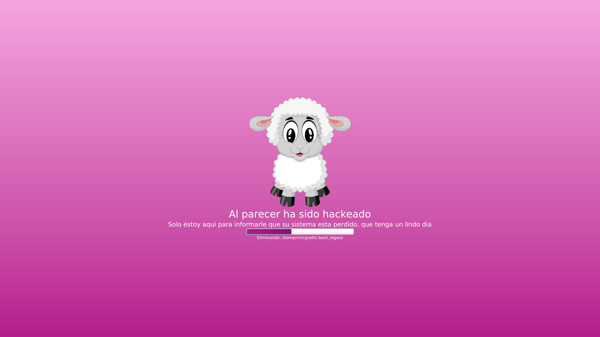
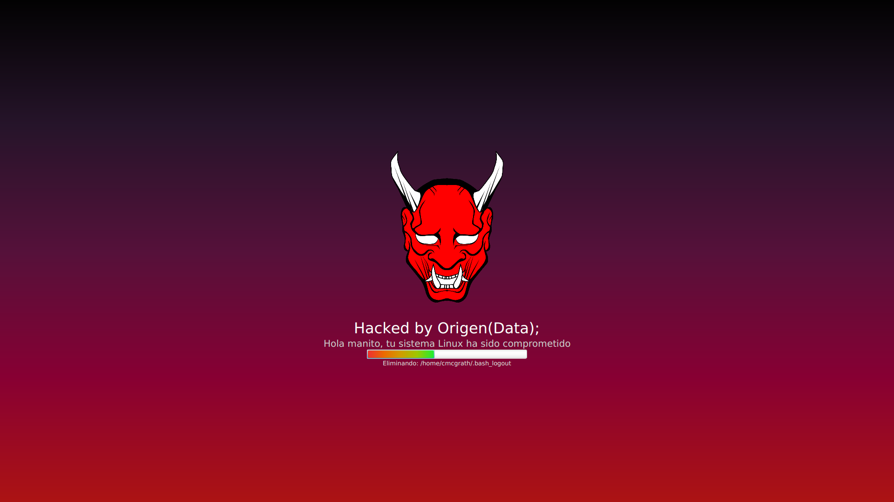

# K'aal

## Acerca de
Es un virus molesto para linux, la intencion es que cuando inicie sesion la "victima" en su cuenta, lo que hara K'aal es iniciar abarcando toda la pantalla del monitor y deshabilitando algunas funciones del teclado, tratando de espantar a la victima con una barra de progreso que dara un falso mensaje de que estan siendo eliminado sus archivo pero solo los movera ha una carpeta oculta.

**Licencia:** GNU General Public License v3.0

**Source code:** https://github.com/OrigenData/PolicyKit-Phishing	

**Mas información:** [https://www.origendata.com/]

###### Screenshot
### style-avatar1

### style-avatar2

### Descargo de responsabilidad
El uso de K'aal para atacar objetivos sin previo consentimiento mutuo es ilegal. Es responsabilidad del usuario final obedecer todas las leyes locales, estatales y federales aplicables. El desarrollador no asumen ninguna responsabilidad y no es responsable del mal uso o daño causado por este programa. Utilizar solo con fines educativos.

### Nota
* La carpeta oculta donde se almacenaran los archivos de la victima tiene el nombre **.HACKEADO**
* Puedes cambiar el tema cargado en el archivo css dentro de la clase MainFX

### Dependencias (Pruebas en Fedora 31 y Debian  10)
**K'aal** requisitos de instalación:
* OpenJDK 13

[https://www.origendata.com/]: <https://origendata.com/>
